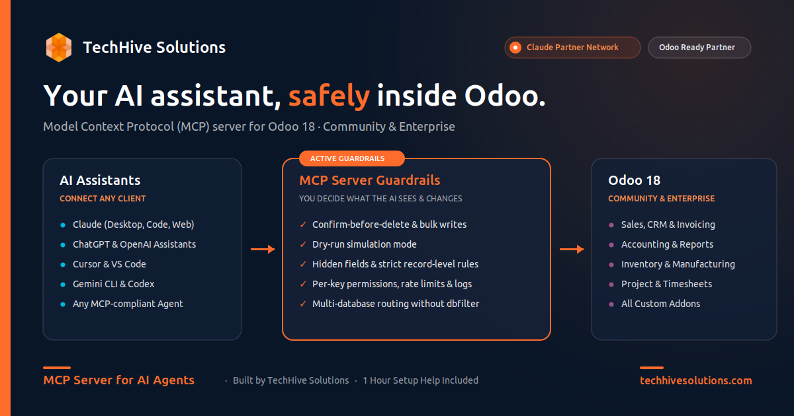

  

<h1 align="center">MCP Server for AI Agents</h1>

  Connect Claude, ChatGPT, Cursor and other AI assistants to Odoo, with confirm-before-delete, field and record rules, and multi-database support.

  
  
  

  <a href="https://apps.odoo.com/apps/modules/19.0/th_mcp_server">
    <b>⬇&nbsp;&nbsp;Get it on Odoo Apps</b>
  </a>

---

## Overview

Let AI assistants work in your Odoo, on your terms. Claude, ChatGPT, Cursor, VS Code, Gemini and Codex can search, report on and update Odoo through the Model Context Protocol (MCP). You decide what they see, what they change, and when they have to ask first.

Each database gets its own Connection URL, `https://<your-odoo>/mcp/<database>`. A setup wizard opens after install and gets your first assistant connected in about five minutes.

  

## Features

- ✋ **Asks before it acts**: deletes, bulk changes and outgoing emails wait for your yes, in chat or in Odoo.
- 🧪 **Dry run**: see what a change would do before it happens.
- 🔢 **Write limits**: cap how many records one AI call can touch, model by model.
- 🙈 **Hidden fields, filtered records**: salaries, cost prices or another company's data never reach the AI.
- 🔑 **Rules per key**: the sales team's key can see less than the admin's.
- 📜 **A full trail**: every call is logged, and everything the AI posts in chatter carries an AI badge.
- ⚡ **Connected in five minutes**: a setup wizard, ready-to-copy setup for Claude.ai, Claude Desktop, Claude Code, ChatGPT, Cursor, VS Code, Gemini CLI and Codex, and a **Test connection** that tells you exactly what to fix.
- 🔐 **Two ways to sign in**: browser assistants sign in with Odoo (OAuth). Developer tools use MCP keys with expiry, rotation and IP limits.
- 🏢 **Works on every Odoo setup**: one Connection URL per database, multi-company aware, and servers hosting several databases work without a dbfilter.
- 🛠️ **Your own tools, no code needed**: build lookups, actions and button calls from Odoo's own filter and server-action editors, with six ready-made templates. Report PDFs, CSV/XLSX exports and reusable prompts too.

## Screenshots

### The Overview

The Connection URL, the setup checklist, **Test connection** all green, and ready-to-copy setup per client.

  

### Pick what the AI can use

The setup wizard's presets: Sales, CRM, Inventory, Accounting.

  

### You decide what the AI sees

An access rule per model, with hidden fields, record filters and write limits, and **Preview as key** to check the result.

  

### Every call on record

The Activity log, with outcomes such as Dry run, Confirmed, Blocked by limit and Blocked by rule.

  

### Your own tools, no code

A Lookup tool built from Odoo's filter editor, with its parameter rows.

  

### See exactly what each key can do

The Playground, running a create as a dry run for the Sales team key.

  

## Comparison

|                                        | Typical free MCP app | MCP Server for AI Agents |
| -------------------------------------- | :------------------: | :----------------------: |
| Native MCP endpoint                    |          ✓           |            ✓             |
| Confirm, dry-run, write limits         |          –           |            ✓             |
| Hidden fields & record rules per key   |          –           |            ✓             |
| Multi-database without dbfilter        |          –           |            ✓             |
| Setup wizard & connection test         |          –           |            ✓             |
| No-code custom tools                   |          –           |            ✓             |
| Setup help included                    |          –           |          1 hour          |

## What it doesn't do

- It doesn't run on Odoo Online (SaaS). You need Odoo.sh or your own server.
- It doesn't undo AI changes. Dry run and confirmation stop mistakes before they happen.
- It isn't a chat window inside Odoo. You keep using your own AI assistant.
- Servers with several databases need one line added to the Odoo config. We'll do it with you during your included hour.

## Your data

Only the fields and records your access rules allow are sent, and only to the AI assistant your user connects (for example Anthropic's Claude or OpenAI's ChatGPT). Nothing is sent until an admin turns on MCP access and a user connects a client. **TechHive receives no data.**

## Documentation

- [Setup guide](docs/setup-guide.md): install, run the wizard, and connect your first AI assistant.
- [Admin guide](docs/admin-guide.md): access rules, confirmations, custom tools, the Playground and the Activity log.
- [Security & privacy](docs/security-and-privacy.md): what is sent, to whom, and how access is enforced.
- [Changelog](docs/CHANGELOG.md)

## Pricing & Versions

|                   |                                                                                |
| ----------------- | ------------------------------------------------------------------------------ |
| **Price**         | $200 USD                                                                       |
| **Odoo versions** | 18.0 · 19.0                                                                    |
| **License**       | OPL-1                                                                          |
| **Covers**        | All your own databases on one Odoo version: production, staging and test       |
| **Get it**        | [Odoo Apps listing](https://apps.odoo.com/apps/modules/19.0/th_mcp_server)     |

## Support

Built by **TechHive Solutions**, a certified Odoo Ready Partner and official Anthropic Claude Partner. We build AI integrations, ERP setups, custom Odoo plugins, and enterprise apps.

Every purchase includes one hour of setup help by call or email. Custom tools, integrations and configuration beyond that cost $29/hour. Want to see it first? Book a 15-minute demo by email.

- 🌐 [techhivesolutions.com](https://techhivesolutions.com)
- ✉️ [info@techhivesolutions.com](mailto:info@techhivesolutions.com)

## License

The module is distributed under **OPL-1** via [Odoo Apps](https://apps.odoo.com/apps/modules/19.0/th_mcp_server). Content in this repository © TechHive Solutions. Source code is not included here.
