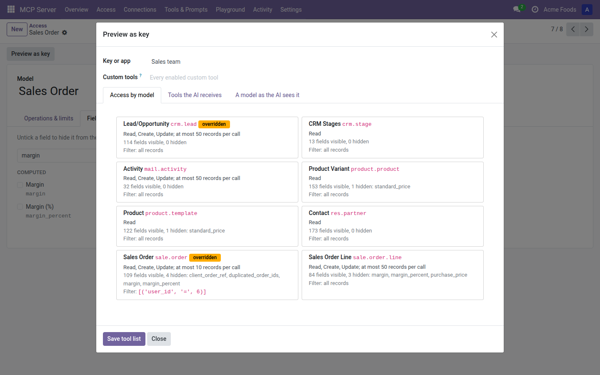
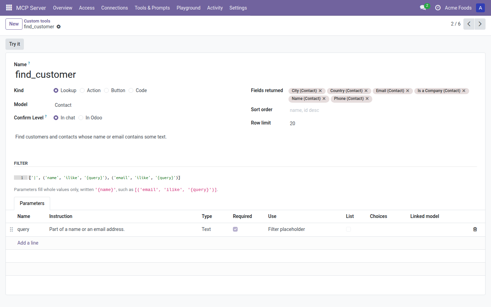
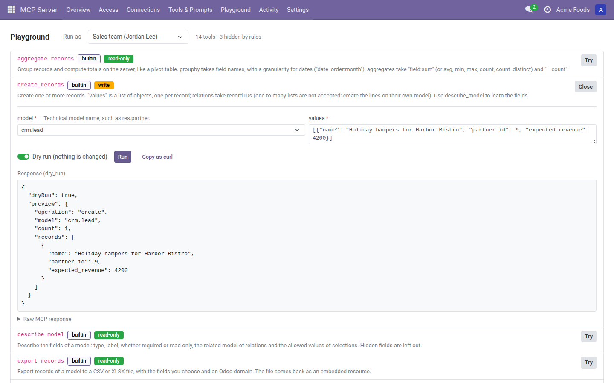
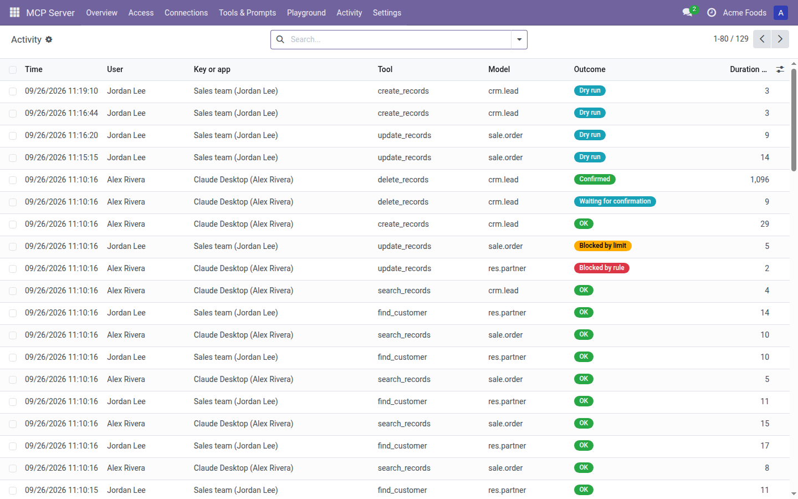

# Admin guide

This guide is for the people who decide what AI assistants may do in your Odoo. It covers Access rules per model, confirmations and dry runs, Custom tools and prompts, reports and exports, the Playground, the Activity log, the AI badge in chatter, and how to manage Credentials. It assumes you have finished the [setup guide](setup-guide.md). You need to be an MCP Server **Administrator** to open the **MCP Server** app. System administrators are MCP Server Administrators automatically.

## Where things are

| Menu | What it's for |
|---|---|
| **MCP Server > Overview** | Connection URL, client instructions, **Test connection**, setup checklist, usage for the last 7 days |
| **MCP Server > Access** | One Access rule per model the AI may reach |
| **MCP Server > Connections** | Every user's MCP keys and OAuth apps |
| **MCP Server > Tools & Prompts > Custom tools** | Your own tools, and the six starter templates |
| **MCP Server > Tools & Prompts > Prompts** | Prompts the AI client offers its user |
| **MCP Server > Playground** | Try any tool as a given Credential or user |
| **MCP Server > Activity** | One row per AI call, with its outcome |
| **MCP Server > Settings** | Server switch, limits and client options (system administrators only) |

## How access works

The AI always acts as the Odoo user who connected it. Every call is limited by three things at once:

1. **The user's own Odoo access rights and record rules.** The AI can never do more than the user could do in Odoo.
2. **Your Access rules.** A model with no Access rule can't be reached at all. Each rule sets which operations are allowed, which fields are hidden and which records are reachable.
3. **The Credential.** A Credential can be read-only, limited to some companies and IP addresses, and narrowed further with overrides.

Overrides and Credential limits only ever take access away. They never add to what the Access rule allows.

## Access rules per model

Open **MCP Server > Access**. The list shows each enabled model, its operations, its **Write cap**, an **Advanced** mark and an **Overrides** mark for models that some Credentials see differently. Use the **Writable** and **Sensitive** filters to find models that allow changes or are unlocked.

To add a model:

1. Click **New**.
2. Pick the **Model**.
3. Set the tabs described below.
4. Save.

### Operations & limits

Under **What the AI may do**:

- **Read**, **Create**, **Update**, **Delete**: tick what the AI may do on this model. New rules allow **Read** only.
- **Write cap**: the most records one call may change, counting creates, updates and deletes together. 0 means no limit. A call over the cap is refused, not cut short. The cap counts the records the call names; records changed by Odoo's own business logic as a side effect aren't counted.

Under **Confirmation**:

- **Confirm**: **Deletes** (the default) or **Deletes and writes**.
- **Confirmation**: **In chat** or **In Odoo**. See [Confirmations](#confirmations).

Deletes are always confirmed, and so are changes to more than 10 records in one call, whatever you choose here.

Under **Method calls**:

- **None** (the default): the AI can't call model methods.
- **Listed methods**: the AI may call only the methods you list in **Methods**, comma-separated, such as `action_confirm, action_cancel`.
- **Any public method (Advanced)**: any business method the model defines, except Odoo's generic record methods, private methods (starting with `_`) and methods that switch user, company or context.

Every method call is confirmed.

Under **Reports**, pick the PDF reports the AI may render for this model. See [Report PDFs and exports](#report-pdfs-and-csvxlsx-exports).

### Fields

Untick a field to hide it from the AI. A hidden field is:

- removed from search and read results, exports and dry-run previews;
- left out of the model's description the AI reads;
- refused in filters, sorting and grouping;
- refused in writes.

Related fields that lead to a hidden field are hidden too, and the checklist shows why ("hidden because ... is hidden"). Computed fields that depend on a hidden field get a warning icon; hide them too if their value gives the hidden one away.

Some models hold a copy of another model's data. For example, the public employee directory copies fields from Employees. When you hide fields on the source model, the form warns you to hide the same fields on the copy, or leave the copy disabled.

### Records

Set a **Record filter** with Odoo's filter editor. Only records that match it are reachable, on top of the user's own access rights. `user` and `company_ids` work as they do in Odoo record rules, so you can write filters such as "only my own leads" or "only the current companies".

A call that names a record outside the filter is refused, not silently narrowed.

### Key overrides

Use this tab to narrow the model for one Credential. Add a row, pick the **Key or app**, and set any of:

- **No access**: the Credential can't reach this model at all.
- **No read**, **No create**, **No update**, **No delete**: turn off an operation the model allows.
- **Write cap**: the lower of this and the model's cap applies. 0 keeps the model's cap.
- **Extra hidden fields**: hidden on top of the model's hidden fields.
- **Extra filter**: combined with the model's **Record filter**, so both must match.

Cells that differ from the model's settings are highlighted. You can also set overrides from the Credential's side: see [Credentials](#credentials).

### Sensitive and blocked models

Some models hold Odoo's own security settings or copies of other models' data, such as system parameters, record rules, access rights, user groups, server actions, scheduled actions, modules, chatter messages, attachments and field definitions. These are sensitive. To enable one, tick **Allow sensitive model** on its Access rule. It is then marked **Advanced**, every write to it is confirmed, and the Overview shows a warning while it is unlocked.

The MCP Server's own settings, API keys and two-factor devices can never be enabled.

### Preview as key

**Preview as key** shows exactly what an AI signed in with a given Credential receives. Open it from the **Access** list, from any Access rule, or from a Credential.

1. Pick the **Key or app**.
2. Read the tabs:
   - **Access by model**: for each model, the allowed operations, the write cap, how many fields are visible and hidden, and the record filter. Overridden models are marked.
   - **Tools the AI receives**: the tool list this Credential gets.
   - **A model as the AI sees it**: pick a **Model** to see the description the AI reads, with hidden fields left out.
3. To limit which Custom tools this Credential gets, set **Custom tools** and click **Save tool list**. Empty means every enabled Custom tool.

## Confirmations

Some calls are held until someone confirms them. A held call is a Pending confirmation. It only goes through when confirmed for exactly the same arguments, by the same Credential, within a short time. If the arguments change at all, a new confirmation is needed.

What gets confirmed:

- every delete;
- every change to more than 10 records in one call;
- every write, when the model's **Confirm** is **Deletes and writes**, and always on sensitive models;
- every method call;
- Custom tools that are destructive or reach outside Odoo (email, SMS, webhooks, or a Code tool marked **Open world**).

### In chat

With **In chat**, the AI client shows the user what the call will do, such as "Delete 3 Contact records: Azure Interior, Deco Addict, Gemini Furniture." The user confirms in the chat. Clients that support it show a confirmation form; others ask the AI to call again with a confirmation. An **In chat** confirmation expires after 5 minutes.

### Confirmation in Odoo

With **In Odoo**, the user approves on an Odoo page instead of in the chat. Use it for anything where you want a person, not the AI client, to say yes.

1. The AI client shows the user a link to Odoo.
2. The user opens it, signed in to Odoo as themselves, and sees "Approve this AI request?" with a summary and the tool.
3. The user clicks **Approve** or **Decline**.
4. The user goes back to the AI app, which finishes the call.

Only the person whose Credential asked can approve. The link expires after 15 minutes. Set **In Odoo** per model with **Confirmation** on the Access rule, or per Custom tool with **Confirm Level**.

### Following confirmations

Pending confirmations don't have a menu of their own. To follow them, open **MCP Server > Activity** and use the **Confirmations** filter. It shows calls that are **Waiting for confirmation**, **Confirmed** or **Declined**, and the **Confirmation channel** of each.

## Dry runs

Every write can be run as a dry run: the AI sees what the call would do, and nothing is changed. AI clients can ask for one on any create, update, delete, method call or Custom tool. Dry runs skip confirmation, because nothing happens. In the Playground, dry run is on by default.

| Tool | What a dry run shows |
|---|---|
| Create | The records that would be created |
| Update | Each record's current values and the new values |
| Delete | The records that would be deleted |
| Method call, Button tool | Which method would run on which records. The method is not called. |
| Action tool | Each step runs and is then rolled back, so nothing is kept. Webhooks are not sent: the dry run shows the URL and the payload instead. |
| Code tool | Nothing. Code tools have no dry run, and the AI is told so. |

Hidden fields are left out of dry-run previews.

## Custom tools

A Custom tool is a tool you define in Odoo, in addition to the built-in tools. Open **MCP Server > Tools & Prompts > Custom tools** and click **New**. Give it a **Name** (lowercase letters, digits and `_`, such as `find_customer`) and a **Description**. The description is what the AI reads to decide when to use the tool, so say plainly what it does and when.

Pick one of four kinds.

### Lookup

Searches one model with a fixed filter.

1. Pick the **Model**.
2. Choose the **Fields returned**, the **Sort order** (such as `name, id desc`) and the **Row limit**.
3. Write the **Filter**. Parameters fill whole values, written `'{name}'`, such as `[('email', 'ilike', '{query}')]`.
4. On the **Parameters** tab, add one row per placeholder, with **Use** set to **Filter placeholder**.

A Lookup is read-only. The model's Access rule still applies: hidden fields, the record filter and the maximum result limit.

### Action

Runs a no-code Odoo server action on records the AI names. Supported steps are Update Record, Create Record, Create Activity, Send Email, Send SMS, Add Followers, Remove Followers, Webhook and Multi.

1. Pick the **Model** and a **Server action** on that model.
2. On the **Parameters** tab, add one **Record link** parameter to that model, with **Use** set to **Records to act on**.

Every Access rule applies to each step: the model must allow the operation, and the record filter, write cap and confirmation all apply. Email, SMS and webhook steps count as reaching outside Odoo, so they are always confirmed.

If someone later edits the server action so it runs Python, the tool is blocked and marked for review. Make it a Code tool, or change the action back to no-code steps, then save the tool to review it.

Email, SMS and activity templates run as configured, so they can include fields you hid. The tool form warns you and names those fields. A webhook step that would send a hidden field is refused.

### Button

Calls one business method, such as `action_confirm`, on records the AI names.

1. Enable the model under **Access** first.
2. Pick the **Model** and enter the **Button method**.
3. Add one **Record link** parameter with **Use** set to **Records to act on**.

A Button tool needs **Update** on the model, and respects the record filter, write cap and confirmation. Tick **Destructive** if the method deletes or undoes things, so every call is confirmed. Methods whose names start with `action_cancel` or `unlink` count as destructive anyway.

### Code (Advanced)

Runs a Python server action (type Execute Code). Only system administrators can create or change Code tools.

A Code tool runs as the calling user under Odoo's own access rights. Access rules, hidden fields and dry runs don't apply to it. You label it yourself:

- **Read only**: you vouch that it changes nothing. Read-only Credentials can then use it.
- **Destructive**: every call is confirmed.
- **Open world**: it reaches outside Odoo, and every call is confirmed.

Code tools can take a hand-written JSON schema on the **Input schema** tab. Other kinds generate their schema from the parameter rows.

### Parameters

Each parameter row has a **Name**, an **Instruction** for the AI, a **Type** (**Text**, **Number**, **Date**, **Yes/No**, **Choice** or **Record link**), **Required**, **Use** (**Filter placeholder**, **Records to act on** or **Value**) and **List** for more than one record. **Choice** parameters need their **Choices**, comma-separated. **Record link** parameters need a **Linked model**, and the AI can only pass records it may read.

### Confirmation, testing and switching tools on and off

- **Confirm Level** sets where destructive and outside-Odoo calls are confirmed: **In chat** or **In Odoo**.
- **Try it** opens the tool in the Playground.
- Use the toggle in the list, or archive the tool, to switch it off. Switched-off tools show an **Off** ribbon.
- To limit a tool to some Credentials, set the Credential's **Custom tools** tab, or use **Save tool list** in **Preview as key**.

### Starter templates

Six starters ship switched off. Use the **Starters** filter to find them.

| Starter | Kind | Switched on by preset |
|---|---|---|
| `find_customer`: find customers by name or email | Lookup | Sales, CRM |
| `open_quotations`: a customer's open quotations | Lookup | Sales |
| `confirm_quotation`: confirm quotations | Button | Sales |
| `overdue_invoices`: unpaid invoices due before a date | Lookup | Accounting |
| `log_note`: log a note on a record | Code | No, switch on by hand |
| `schedule_follow_up`: schedule a to-do activity | Code | No, switch on by hand |

The two Code starters check the model's Access rule before they post a note or schedule an activity. Because they are Code tools, only a system administrator can switch them on. Upgrades never overwrite your edits to a starter.

## Prompts

A prompt is a ready-made message the AI client offers its user, often as a slash command. Open **MCP Server > Tools & Prompts > Prompts**.

1. Click **New**.
2. Enter a **Name** (such as `weekly_sales_summary`), a **Title** the client shows, and a **Description**.
3. Write the **Template**. Put `{argument}` where an argument goes, such as "Summarise our sales for the week starting {week_start}".
4. On the **Arguments** tab, add a row for each argument.

Three starter prompts ship switched off: **Weekly sales summary** (switched on by the Sales preset), **Pipeline review** (CRM) and **Chase overdue invoices** (Accounting).

## Report PDFs and CSV/XLSX exports

**Reports.** The AI can render a PDF report, such as a quotation or an invoice, only if you list it under **Reports** on the model's Access rule. It can only render it for records it may read. Odoo renders a report as it is, so hidden fields are not removed from reports. The Access rule warns you and names the hidden fields each allowed report prints.

**Exports.** The AI can export records to CSV or XLSX with the fields it chooses. Exports follow every Access rule, exactly like a read: hidden fields, the record filter and your permissions. **Max export rows** in Settings caps each export (2,000 by default).

## Playground

The Playground lets you try any tool as a given Credential or user, without an AI client. Open **MCP Server > Playground**.

1. In **Run as**, pick a key or app, or a user. The list shows the tools that Credential or user can see, with each tool's kind, labels and description, and a count of tools hidden by rules.
2. Click **Try** on a tool.
3. Fill in the parameters.
4. Leave **Dry run (nothing is changed)** on to preview a write, or turn it off to run it for real.
5. Click **Run**.

If the call needs confirmation, a card shows what the AI client would ask. Click **Confirm** or **Decline**. At level **In Odoo**, you can approve only your own Credential's calls; otherwise the card says who must approve.

After a run, **Copy as curl** copies an equivalent request to the Connection URL, with `$MCP_KEY` where the key goes.

Any MCP Server Administrator can browse the catalogue. Only a system administrator can run tools as another user. Playground runs appear in the Activity log with source **Playground** and don't count toward rate limits.

## Activity log

Every call an AI client makes is recorded under **MCP Server > Activity**. Each row has the **Time**, **User**, **Key or app**, **Tool**, **Model**, **Outcome** and **Duration (ms)**.

| Outcome | Meaning |
|---|---|
| **OK** | The call ran. |
| **Confirmed** | The call was confirmed and ran. |
| **Waiting for confirmation** | The call is a Pending confirmation. |
| **Declined** | The user declined, so nothing changed. |
| **Dry run** | The call was previewed. Nothing changed. |
| **Blocked by rule** | An Access rule, a hidden field, a read-only Credential or a record filter refused the call. |
| **Blocked by limit** | The call went over a write cap or a rate limit. |
| **Error** | The call failed, for example on an Odoo validation error. Nothing it started was kept. |

Open a row to see the **Reason**, the Credential, the **Source** (MCP, XML-RPC or Playground), the **Protocol revision**, the **IP address**, the **Argument names**, the **Fields** touched, the **Record IDs** and the **Confirmation channel**. Only argument names, fields and record IDs are kept, never values.

- **Open record** opens the records the call touched.
- **Open in Playground** opens the same tool in the Playground, as the same Credential.
- Filters: **Blocked**, **Errors**, **Confirmations**, **Changes**, **Today**, **Last 7 days** and **Playground**. Group by **Outcome**, **Tool**, **User** or **Day**.

Activity older than **Activity retention** in Settings (90 days by default) is deleted. Set it to 0 to keep everything.

## AI badge in chatter

Everything the AI posts in chatter carries an **AI** badge with the name of the key or app, such as "AI · Claude Code on my laptop". This includes notes, messages and the change tracking Odoo writes when the AI updates a record. Hover over the badge to see "Made by an AI assistant through ...". The badge can only be set by an AI call, so nobody can add it or remove it by hand.

## Credentials

### What users manage

Each MCP User manages their own Credentials under **My Preferences > AI connections**. The list shows each key or app with its **Type**, **Read only**, **Companies**, **Expires**, **Last used** and status: **Active**, **Rotated**, **Expired** or **Revoked**.

- **Rotate** (MCP keys only) creates a new key with the same settings and shows it once. The old key keeps working for 7 more days, so you have time to update your client. It shows as **Rotated** meanwhile.
- **Revoke** stops the key or app at once.

MCP keys also appear in Odoo's own API key list. Deleting one there removes it completely.

### What admins manage

Open **MCP Server > Connections** to see every user's keys and OAuth apps. Use the **Not revoked**, **MCP keys** and **OAuth apps** filters, or group by **User**. On a Credential you can:

- tick **Read only**. A read-only Credential can't be given write access again: the user creates a new key, or reconnects the app with **Read and write**;
- limit **Companies**. Empty means all of the user's companies, and a Credential never reaches companies its user has lost;
- set an **IP allowlist**, one address or CIDR range per line;
- add **Access overrides**, one row per model, which work like **Key overrides** on the Access rule;
- limit **Custom tools**. Empty means every enabled Custom tool;
- **Preview as key** or **Revoke**.

Removing a user from **MCP User**, or archiving them, stops all their Credentials on the next request. Removing them from **MCP User: Write** makes all their Credentials read-only.

### Expiry

**Longest key lifetime** in **MCP Server > Settings** caps every MCP key and OAuth app: **30 days**, **90 days**, **1 year** (the default) or **No limit**. Keys can only be set to **Never** expire when it is **No limit**.

If you lower it, Odoo shows how many keys and apps will be shortened and the new date before it applies. Click **Shorten them** to apply, or **Keep the current lifetime**.

An OAuth app also expires after 90 days without use.

## Settings reference

Open **MCP Server > Settings**.

| Setting | Default | What it does |
|---|---|---|
| **MCP enabled** | Off until the wizard | When off, AI clients get an error on every call to this database. |
| **Longest key lifetime** | 1 year | Caps MCP keys and OAuth apps. |
| **Activity retention** | 90 days | Older activity is deleted. 0 keeps everything. |
| **Calls per connection per minute** | 120 | Rate limit per Credential. |
| **Failed sign-ins per IP per minute** | 30 | Counts failed sign-ins only. |
| **Default result limit** / **Maximum result limit** | 50 / 500 | How many records a search returns by default and at most. |
| **Max export rows** | 2,000 | The export cap. |
| **Client ID metadata documents** | On | Lets apps such as Claude and ChatGPT identify themselves with an https URL. **Allowed app hosts** narrows it to the hosts you list. |
| **Open client registration** | Off | Lets any app register itself. Off is safer: use **Create a client** in the setup wizard instead. |
| **Origin allowlist** | On | Browser-based clients must come from an allowed origin. Empty means this Odoo and known AI clients. |

Need help? Email info@techhivesolutions.com
