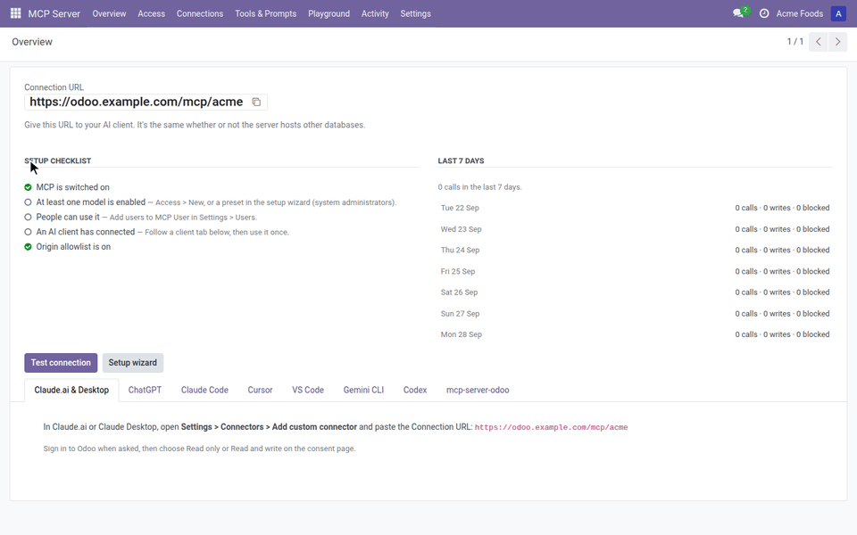
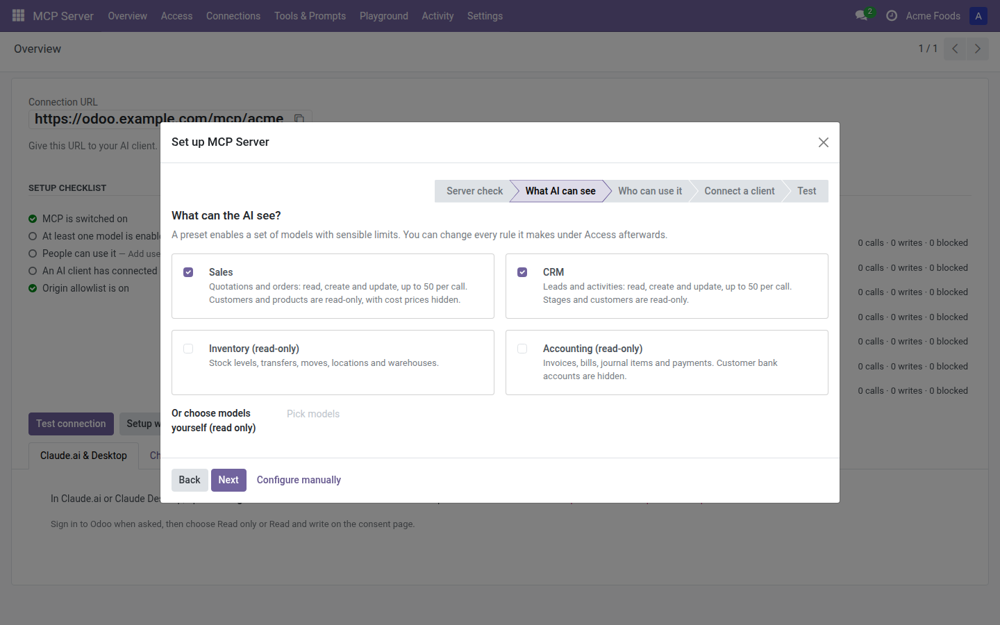
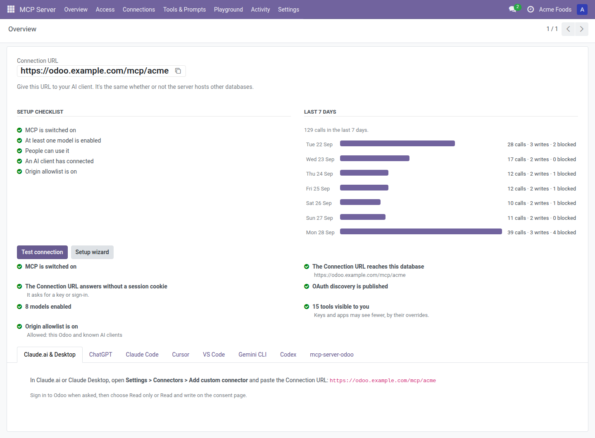

# Setup guide

This guide takes you from installing MCP Server for AI Agents to a working AI assistant in Odoo 16.0, 17.0, 18.0 or 19.0. You install the module, run the setup wizard, create a Credential, and give your AI client the Connection URL. Most setups take about five minutes. The module runs on Odoo.sh and on your own server. It does not run on Odoo Online (SaaS).



## Before you start

- You need Odoo 16.0, 17.0, 18.0 or 19.0 on Odoo.sh or on your own server.
- You need to be a system administrator in Odoo to run the setup wizard and change settings.
- Your Odoo must be reachable over HTTPS from wherever your AI client runs. Claude.ai and ChatGPT connect from the internet, so a server that is only reachable on your office network won't work with them.
- If Odoo runs behind a reverse proxy (nginx, Caddy, a load balancer), start Odoo with `--proxy-mode`. Without it, the Connection URL and client IP addresses can be wrong, and the Overview shows a warning.

## 1. Install the module

1. Add the module to your addons path, as you would any other Odoo app.
2. In Odoo, open **Apps**, click **Update Apps List**, search for **MCP Server for AI Agents**, and click **Activate**.
3. After install, the setup wizard opens on its own. You can also open it later from **MCP Server > Overview > Setup wizard**.

MCP access stays switched off after install. Nothing is reachable by an AI client until you finish the wizard or switch it on in Settings.

## 2. Run the setup wizard

The wizard has five steps: **Server check**, **What AI can see**, **Who can use it**, **Connect a client** and **Test**. Use **Next** and **Back** to move between them. **Configure manually** closes the wizard without changing anything.



### Server check

1. Copy the Connection URL shown under **Your Connection URL**. It looks like `https://<host>/mcp/<database>`.
2. If you see "The server is ready for AI clients", click **Next**.
3. If you see a red warning that the server hosts several databases, add the line it shows to your Odoo config and restart Odoo. See [Multi-database servers](#multi-database-servers) below.

### What AI can see

Tick one or more presets. Each preset only appears when the matching Odoo app is installed.

| Preset | What it enables |
|---|---|
| **Sales** | Quotations and orders: read, create and update, up to 50 per call. Customers and products are read-only, with cost prices hidden. |
| **CRM** | Leads and activities: read, create and update, up to 50 per call. Stages and customers are read-only. |
| **Inventory (read-only)** | Stock levels, transfers, moves, locations and warehouses. |
| **Accounting (read-only)** | Invoices, bills, journal items and payments. Customer bank accounts are hidden. |
| **Employees (directory only)** | Names, jobs, departments and work contacts from the public directory. |

You can also pick models in **Or choose models yourself (read only)**. Those models get read access only.

A preset also switches on the matching starter Custom tools and prompts. Every rule a preset creates can be changed afterwards under **MCP Server > Access**. See the [admin guide](admin-guide.md).

### Who can use it

1. In **MCP Users**, add the people who may connect an AI assistant. The assistant acts as that person, with that person's Odoo access rights.
2. In **Can also make changes**, add the MCP Users whose AI assistants may create, update or delete records. Everyone else gets read access only.

Taking someone off either list removes that access. MCP Administrators keep theirs.

You can also manage this later in **Settings > Users & Companies > Users**, in the **MCP Server** section of each user: **MCP User**, **MCP User: Write** or **Administrator**.

### Connect a client

This step shows the instructions for Claude.ai and Claude Desktop, Claude Code and VS Code. The same instructions, plus the other clients, are on the Overview later.

Cursor, Gemini CLI and MCP Inspector ask for a client ID and secret when they sign in with Odoo. If you want one of them to sign in that way:

1. Click **Create a client for Cursor**, **Create a client for Gemini CLI** or **Create a client for MCP Inspector**.
2. Copy the **Client ID** and **Client secret** right away. The secret won't be shown again.
3. Paste both into the client when it asks.

You can skip this and use an MCP key with those clients instead. See [Create a Credential](#4-create-a-credential).

### Test

Clicking **Next** on the previous step applies your choices and switches MCP on.

1. Click **Run test**. The wizard runs the same checks an AI client would hit.
2. Fix anything marked with a red cross. Each failed check says what to do.
3. Click **Finish**. The wizard opens **MCP Server > Overview**.

## 3. Turn MCP access on or off

The wizard switches MCP on for you. To switch it on or off by hand:

1. Open **MCP Server > Settings** (or **Settings > MCP Server**).
2. Tick or untick **MCP enabled**.
3. Click **Save**.

When it is off, AI clients get an error on every call to this database.

## 4. Create a Credential

A Credential is what an AI client signs in with. There are two kinds:

- **OAuth app (Sign in with Odoo)**: best for Claude.ai, Claude Desktop, ChatGPT and VS Code. You paste the Connection URL into the client, sign in to Odoo in your browser, and choose what the app may do. Nothing to copy.
- **MCP key**: best for developer tools such as Claude Code, Cursor, Gemini CLI, Codex and the `mcp-server-odoo` bridge. You create a key in Odoo and paste it into the client's config.

Only MCP Users can create Credentials, and each person creates their own.

### Sign in with Odoo (OAuth)

1. Add the Connection URL to your AI client (see [Connect your AI client](#6-connect-your-ai-client)).
2. The client opens an Odoo sign-in page. Sign in as yourself.
3. On the consent page ("<app> wants to connect to Odoo"), choose **Read only** or **Read and write**. **Read and write** only appears if you are allowed to make changes.
4. If you work in more than one company, untick any **Companies** the app should not reach.
5. Click **Allow**.

The app now appears under **My Preferences > AI connections**. It stays connected until you revoke it, until it reaches the **Longest key lifetime**, or until it goes 90 days without being used.

If an app you allowed as **Read only** later tries to make a change, the client asks you to sign in again. The consent page then says "This replaces the app's read-only access to let it make changes."

### Create an MCP key

1. Click your avatar in the top right, then **My Preferences**.
2. Open the **AI connections** tab.
3. Click **New MCP key**. Odoo may ask for your password.
4. Fill in:
   - **Name**: where you use it, such as "Claude Code on my laptop".
   - **Expiry**: **30 days**, **90 days**, **1 year** or **Never**. Your admin's **Longest key lifetime** can limit this.
   - **Read only**: tick it if the AI should never change data. If you aren't allowed to make changes, it is always ticked.
   - **Companies**: leave empty for all your companies, or pick some.
   - **IP allowlist**: leave empty for any address, or enter one address or CIDR range per line.
5. Click **Create key**.
6. Copy the key now. It won't be shown again.

Your AI client sends the key in an `Authorization: Bearer <MCP key>` header. Odoo's own API keys, created under **Account Security**, don't work for AI connections.

## 5. Find the Connection URL

The Connection URL is `https://<host>/mcp/<database>`, for example `https://erp.example.com/mcp/production`.

1. Open **MCP Server > Overview**.
2. Copy the URL at the top with the copy button.

Each database has its own Connection URL. It is the same whether or not your server hosts other databases.



## 6. Connect your AI client

The Overview has one tab per client with copy-ready instructions and your real Connection URL filled in. The steps below match those tabs. Replace `<Connection URL>` with yours and `<MCP key>` with a key from step 4.

### Claude.ai and Claude Desktop

1. In Claude.ai or Claude Desktop, open **Settings > Connectors > Add custom connector**.
2. Paste the Connection URL.
3. Sign in to Odoo when asked, then choose **Read only** or **Read and write** on the consent page.

### ChatGPT

1. In ChatGPT, open **Settings > Connectors** and create a connector.
2. Paste the Connection URL.
3. Sign in to Odoo when asked, then choose **Read only** or **Read and write** on the consent page.

### Claude Code

Run this, then type `/mcp` in Claude Code to sign in with Odoo:

```
claude mcp add --transport http odoo <Connection URL>
```

Or, with an MCP key:

```
claude mcp add --transport http odoo <Connection URL> --header "Authorization: Bearer <MCP key>"
```

### Cursor

Add this to `~/.cursor/mcp.json`:

```json
{
  "mcpServers": {
    "odoo": {
      "url": "<Connection URL>",
      "headers": {
        "Authorization": "Bearer <MCP key>"
      }
    }
  }
}
```

To sign in with Odoo instead of a key, create a client in the setup wizard's **Connect a client** step and give Cursor the client ID and secret.

### VS Code

Add this to `.vscode/mcp.json`. VS Code signs you in with Odoo:

```json
{
  "servers": {
    "odoo": {
      "type": "http",
      "url": "<Connection URL>"
    }
  }
}
```

### Gemini CLI

Add this to `~/.gemini/settings.json`:

```json
{
  "mcpServers": {
    "odoo": {
      "httpUrl": "<Connection URL>",
      "headers": {
        "Authorization": "Bearer <MCP key>"
      }
    }
  }
}
```

### Codex

Put your MCP key in the `ODOO_MCP_KEY` environment variable, then add this to `~/.codex/config.toml`:

```toml
[mcp_servers.odoo]
url = "<Connection URL>"
bearer_token_env_var = "ODOO_MCP_KEY"
```

### mcp-server-odoo bridge

The `mcp-server-odoo` bridge connects over XML-RPC. Put an MCP key in its password setting. Odoo passwords and general API keys are refused.

```
ODOO_URL=https://<host>
ODOO_DB=<database>
ODOO_USER=<your login>
ODOO_PASSWORD=<MCP key>
```

## 7. Test connection

1. Open **MCP Server > Overview**.
2. Click **Test connection**.
3. Read the results. A green tick means the check passed, an orange triangle is a warning, and a red cross must be fixed.

The checks include:

- MCP is switched on.
- The Connection URL reaches this database.
- On a Multi-database server, the module is loaded server-wide.
- The Connection URL answers without a session cookie and asks for a key or sign-in.
- OAuth discovery is published. Claude.ai and ChatGPT need it to sign in.
- How many models are enabled, and how many tools are visible to you.
- Whether the Origin allowlist is on.
- Whether Odoo seems to run behind a proxy without `proxy_mode`.

If Odoo can't reach its own Connection URL (common behind some firewalls), the test shows a warning. Clients outside may still reach it, so try connecting a client.

The **Setup checklist** on the Overview also tracks your progress: MCP is switched on, at least one model is enabled, people can use it, an AI client has connected, and the Origin allowlist is on.

## Multi-database servers

A Multi-database server is one Odoo server process that hosts several databases, with no dbfilter pinning each request to one database. On such a server, the module must be loaded server-wide, or clients get a 404.

The Overview and the wizard's **Server check** step show a red warning when this is needed. To fix it:

1. Add this line to your Odoo config file (`odoo.conf`), in the `[options]` section:

   ```
   server_wide_modules = base,web,th_mcp_server
   ```

   If you already have a `server_wide_modules` line, add `th_mcp_server` to the end of it instead.
2. Restart Odoo.
3. Click **Test connection** on the Overview to check it.

Each database keeps its own Connection URL, such as `https://<host>/mcp/sales_db` and `https://<host>/mcp/demo_db`. If the Overview doesn't show the warning, you don't need this line.

This is covered by your included hour of setup help. We'll do it with you if you like.

## Staging and duplicate databases

When Odoo.sh or `odoo-bin neutralize` makes a neutralized copy of a database, every MCP key and OAuth app from production is revoked on the copy, and anything waiting for confirmation is dropped. The Overview shows "This is a neutralized copy. Keys from production were revoked." Create new Credentials on the copy if you want to test there. A staging database's Connection URL can change between Odoo.sh builds.

## Troubleshooting

| What you see | What to do |
|---|---|
| Clients get 404 | On a Multi-database server, add the `server_wide_modules` line above. Also check that the database name in the Connection URL is exact. |
| "MCP is switched off" | Tick **MCP enabled** in **MCP Server > Settings**. |
| The client says the key is a general Odoo API key | Create an MCP key under **My Preferences > AI connections**. Odoo's own API keys don't work. |
| "The user of this connection is not an MCP User" | Add the user to **MCP User** in the user's settings, or rerun the wizard. |
| "This connection is not allowed from this IP address" | Check the Credential's **IP allowlist**. Behind a proxy, start Odoo with `--proxy-mode`. |
| The AI says it has no access to a model | Enable the model under **MCP Server > Access**. |
| The AI can read but not change anything | Check that the user is in **MCP User: Write**, that the Credential isn't **Read only**, and that the model allows **Create**, **Update** or **Delete**. |

Need help? Email info@techhivesolutions.com
